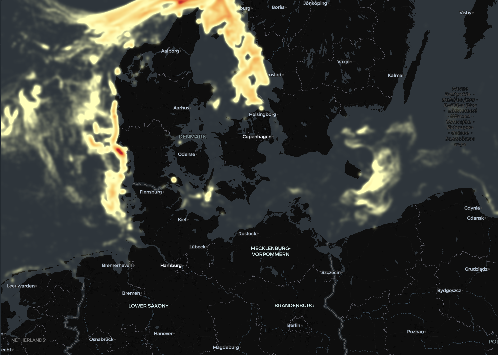
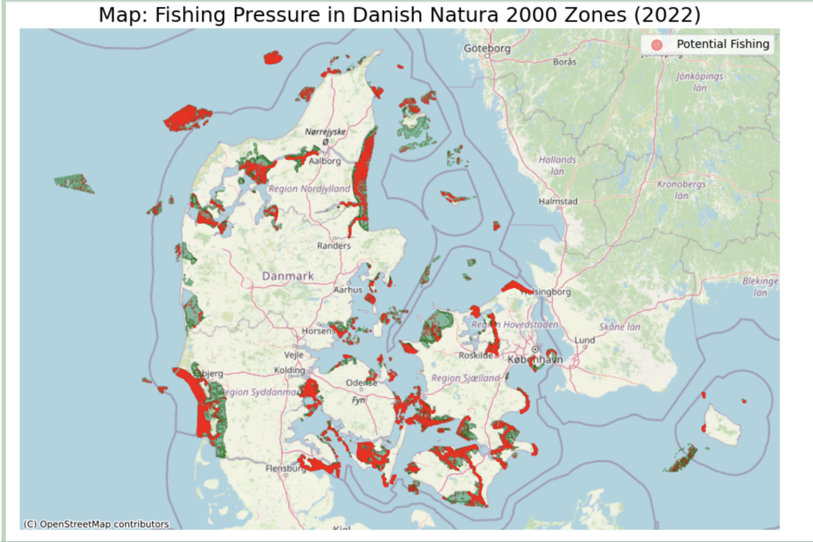
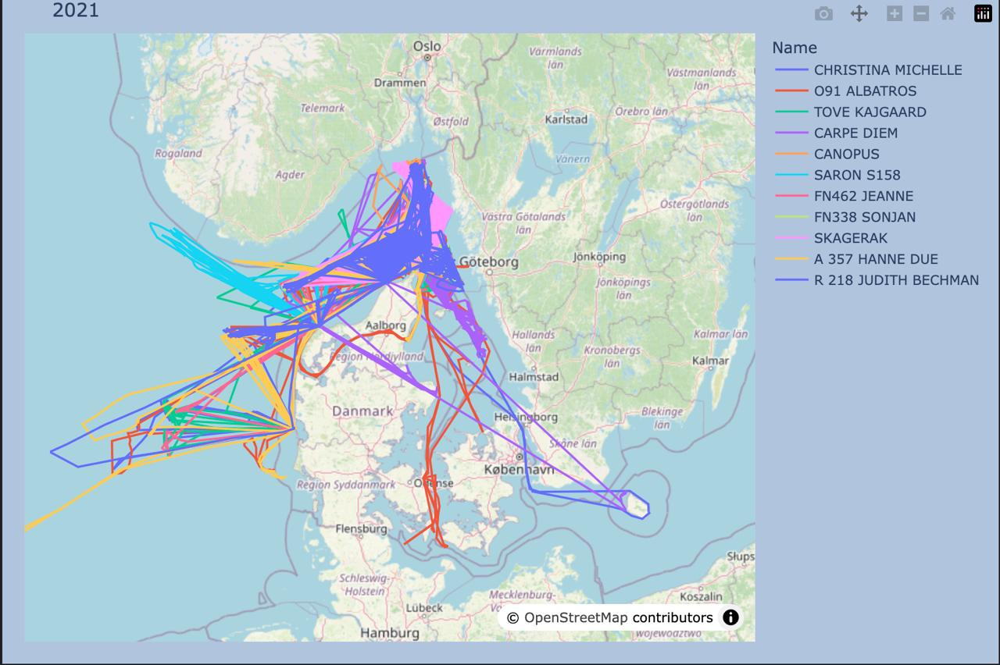

# 🎣 Tracking Danish Fishing Vessels with AIS Data

> Mapping where — and how intensively — fishing happens in Danish waters, and flagging the
> activity that takes place inside protected marine zones. Built in 48 hours for the 2026
> **SODAS Hackathon** at the University of Copenhagen.



*Heatmap of active fishing around Denmark (2024). Brighter areas = more time spent fishing.*

---

## 📖 About the Project

This was **Team Vega's** entry to the annual [SODAS (Social Data Science)
Hackathon](https://sodas.ku.dk/) at the University of Copenhagen. I served as **team
leader**, coordinating the work and the analytical direction across the weekend.

We worked with **AIS (Automatic Identification System)** data — the GPS-style signals that
ships continuously broadcast — published by the Danish Maritime Authority. The raw archive
covers *every* vessel in Danish waters and runs to **100+ million rows per year**, so a big
part of the challenge was simply wrangling data of that size on laptops.

We narrowed the focus to **fishing vessels from 2021 to 2026** and asked two questions:

1. **Where does Danish fishing actually happen, and how does it shift year to year?**
2. **How much fishing pressure falls inside legally protected Natura 2000 marine areas —
   and which vessels are responsible?**

## ✨ What We Built

- **🗺️ Year-by-year fishing heatmaps (2021–2026)** — interactive maps revealing the main
  fishing grounds in the North Sea, Skagerrak, Kattegat and the Belts, and how the hotspots
  move over time.
- **🚢 Per-vessel route tracking** — reconstructing individual boats' tracks from their pings
  to reveal home ports and fishing patterns.
- **🛡️ Protected-zone "incursion" analysis** — a spatial join of fishing activity against
  Denmark's Natura 2000 marine zones that quantifies and ranks fishing pressure inside
  protected habitats.

### A behavioural trick for spotting active fishing
A trawling vessel moves slowly and steadily. So rather than guessing, we flagged **active
fishing** as pings where the navigational status is `Engaged in fishing` *and* speed over
ground sits between **1–5 knots** — the tell-tale signature of a boat dragging a net.

## 🔍 Key Findings (2022 protected-zone analysis)

| Metric | Value |
| --- | --- |
| Fishing pings recorded **inside** Natura 2000 zones | ~651,000 |
| Of those, flagged as **active trawling** (2–5 kn) | ~78,800 |
| Share of in-zone activity that looks like active fishing | **≈ 12%** |

In other words, roughly **one in eight** fishing pings inside Denmark's protected marine
areas showed the slow, steady speed signature of active trawling — concentrated in clear
coastal hotspots that an inspector could prioritise.

<table>
  <tr>
    <td></td>
    <td></td>
  </tr>
  <tr>
    <td align="center"><em>Fishing pressure (red) inside protected zones (green), 2022</em></td>
    <td align="center"><em>Reconstructed tracks of individual named vessels</em></td>
  </tr>
</table>

> 🖥️ **Try it live:** open [`docs/fishing_heatmap_2025_sample.html`](docs/fishing_heatmap_2025_sample.html)
> in a browser for an interactive version of the heatmap.

## 🛠 Tech Stack

- **Big-data wrangling:** [Polars](https://pola.rs/) (lazy `scan_parquet` to filter 100M+
  rows on a laptop), pandas, PyArrow
- **Geospatial:** GeoPandas, Shapely, contextily (spatial joins, reprojection, basemaps)
- **Visualisation:** PyDeck (interactive heatmaps), Plotly (density & route maps), Matplotlib
- **Environment:** Python 3.11, JupyterLab

## 🚀 Getting Started

### Prerequisites
- Python 3.11+
- The datasets (see **[Data](#-data)** below — not included in the repo)

### Installation
```bash
git clone https://github.com/<your-username>/danish-fishing-ais.git
cd danish-fishing-ais

python -m venv .venv && source .venv/bin/activate   # optional but recommended
pip install -r requirements.txt

jupyter lab
```

Then run the notebooks in order (see below).

## 📁 Project Structure

```
.
├── notebooks/
│   ├── 01_data_preparation.ipynb       → filter raw AIS down to fishing vessels
│   ├── 02_fishing_heatmaps.ipynb       → year-by-year heatmaps + per-vessel routes
│   └── 03_protected_zone_analysis.ipynb→ Natura 2000 incursion analysis
├── data/                               → datasets (git-ignored; see data/README.md)
│   ├── raw/        raw AIS Parquet (download)
│   ├── fishing/    fishing-only Parquet (generated by notebook 01)
│   └── N2000/      Natura 2000 shapefiles (download)
├── docs/
│   ├── images/                         → heatmap, Natura 2000 & route visuals
│   ├── DATA_DICTIONARY.md              → AIS field reference
│   ├── BIG_DATA_TIPS.md                → how we handled 100M+ rows on laptops
│   ├── fishing_heatmap_2025_sample.html→ sample interactive map
│   ├── SODAS_Hackathon_Presentation.pdf→ the final hackathon presentation
│   └── Hackathon_Certificate.pdf
├── requirements.txt
└── LICENSE
```

## 📦 Data

The data is **not stored in this repository** (it is far too large for GitHub). Everything is
re-downloadable or regenerable — full instructions are in **[`data/README.md`](data/README.md)**.

- **Raw AIS data** — Danish Maritime Authority:
  https://www.dma.dk/safety-at-sea/navigational-information/ais-data
- **Natura 2000 protected areas** — Danish Environmental Protection Agency (MiljøGIS shapefiles)
- **Fishing-only Parquet** — produced by running `notebooks/01_data_preparation.ipynb`

See **[`docs/DATA_DICTIONARY.md`](docs/DATA_DICTIONARY.md)** for the AIS field reference.

## 👥 Team

**Team Vega — SODAS Hackathon 2026, University of Copenhagen.**
Led by **Jakob Bell** (team leader), with teammates contributing across data engineering,
geospatial analysis and visualisation.

## 📄 License

[MIT](LICENSE) — code is free to reuse. Note that the underlying AIS and Natura 2000
datasets are governed by their respective providers' terms.
